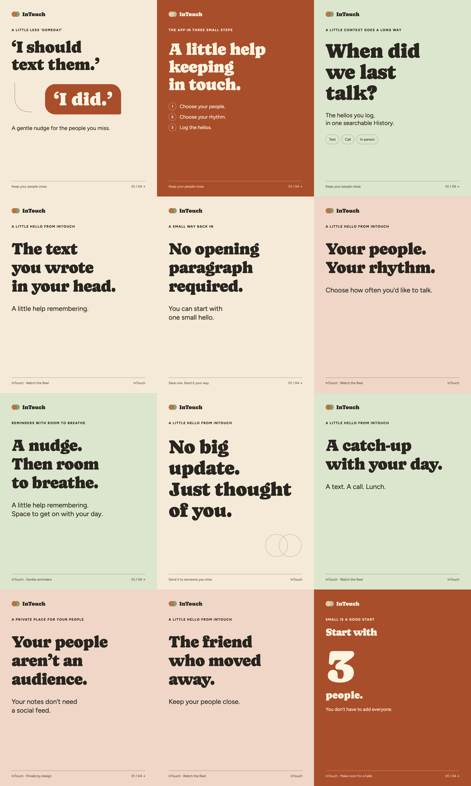

# ddskills

Agent workflows from my development practice: verifying Apple apps, transcribing recordings locally, and keeping implementation decisions readable after the conversation ends.

Seven skills with instructions, executable helpers, templates, and tests. Built around Codex; platform and tool requirements vary by skill.

## Start here

| If you want to… | Try | What it produces |
| --- | --- | --- |
| Verify an Apple app change with appropriate tests and clear evidence | [run-apple-verification-loop](skills/run-apple-verification-loop/README.md) | Focused verification; guarded device lanes when isolation is needed |
| Turn a completed recording into a local, speaker-labelled transcript | [transcribe-diarize](skills/transcribe-diarize/SKILL.md) | Timestamped Markdown and structured speaker turns |
| Understand why an agent implemented a feature a particular way | [maintain-implementation-notes](skills/maintain-implementation-notes/README.md) | One self-contained HTML page of decisions, questions, and verification evidence |

## Install and use

Install one skill globally for Codex with the [skills CLI](https://github.com/vercel-labs/skills):

```sh
npx skills add dominikdrag/ddskills --skill maintain-implementation-notes -g -a codex -y
```

Then ask your agent:

```text
Use $maintain-implementation-notes while implementing the feature described in
specs/export.md. Keep the decisions, unresolved questions, and actual check
results in an HTML page beside the specification.
```

Replace the specification path with your own. For the other starting points:

```text
Use $run-apple-verification-loop to verify the current changes. Read this
repository's testing rules first and run the relevant checks.
```

```text
Use $transcribe-diarize on /path/to/interview.m4a. The recording is in English
and has two speakers. Keep the recording and transcript local.
```

List skills before installing, or install the whole collection:

```sh
npx skills add dominikdrag/ddskills --list
npx skills add dominikdrag/ddskills --skill '*' -g -a codex -y
```

Installation copies the skill packages; it does not install their runtime dependencies or download transcription models. Use the actual installed skill directory when running its helper scripts directly. Project-local installations and other agent hosts may use different paths.

## All skills and requirements

| Skill | Use it for | Requirements |
| --- | --- | --- |
| [maintain-implementation-notes](skills/maintain-implementation-notes/README.md) | A readable decision and evidence record for a specification | File access; a browser for visual review |
| [run-apple-verification-loop](skills/run-apple-verification-loop/README.md) | Proportional Apple tests, snapshots, and runtime verification | macOS, Xcode and Python 3; Device Hub and Computer Use for the documented interactive lane |
| [transcribe-diarize](skills/transcribe-diarize/SKILL.md) | Completed-file transcription and diarization on the Mac | Apple Silicon, Python 3, Git, Swift, FFmpeg; public model/runtime downloads; WhisperKit CLI for that engine |
| [orchestrate-implementation-run](skills/orchestrate-implementation-run/SKILL.md) | Several independent implementation slices with one integration owner | Agent delegation; implementation-notes skill; Apple verification skill for Apple work |
| [coordinate-multi-ticket-run](skills/coordinate-multi-ticket-run/README.md) | Dependency-ordered tickets, checked state transitions, and interrupted-run recovery | Python 3, agent delegation, implementation-notes skill; Apple verification skill for Apple work |
| [app-social-campaign](skills/app-social-campaign/SKILL.md) | App positioning, finished social assets, captions, and a review pack | Product assets; Node.js, Playwright and Sharp for HTML artwork; Python with Pillow; FFmpeg/ffprobe for video |
| [social-campaign-lab](skills/social-campaign-lab/SKILL.md) | Parallel static campaign concepts, review decisions, and a validated handoff | Node.js and Codex task creation/coordination tools; authentic product captures |

The Markdown format can be read by other agents, but host-specific delegation, task, and UI tools need adaptation. Model selection follows the user's or host's configuration; no particular model ID is required. Install the supporting skills listed above when choosing an orchestration skill individually.

## Worked example: an app campaign

The InTouch example shows how a product's visual identity and concrete use cases become a campaign. The [walkthrough](skills/app-social-campaign/references/intouch-example.md) explains the sequence, sample review, and delivery choices.



This is an example of creative output, not evidence of campaign performance. The included walkthrough and image are self-contained; no private app repository is needed to read them or use the skill.

## Check the helpers

From a checkout of this repository:

```sh
python3 skills/coordinate-multi-ticket-run/scripts/self_test.py
python3 skills/run-apple-verification-loop/scripts/self_test.py
python3 -m unittest discover -s skills/transcribe-diarize/tests -v
node --test skills/social-campaign-lab/scripts/campaign-assets.test.mjs
```

These checks exercise workflow transitions, device guards with fake tools, transcription routing/alignment with fixtures, and campaign artifact rules. They do not run an Apple app, measure transcription accuracy, or evaluate an agent's creative judgment.

## Maintenance and license

I maintain these skills for my own work and share updates as they prove useful. Focused bug reports and improvements are welcome; include the skill, agent host, reproduction, and expected result. Remove private recordings, transcripts, credentials, and project data from reports.

[MIT licensed](LICENSE). See [third-party notices](THIRD_PARTY_NOTICES.md) for external dependencies and example assets.
